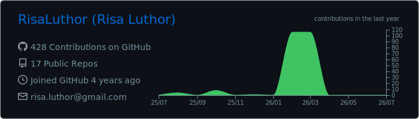
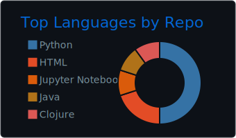

# Risa Luthor

**Applied AI & Enterprise Systems Engineer**

I build AI-centric, governance-aware software for real enterprise environments focused on intelligent automation, secure integration, and logic-heavy workflow reliability.

---

## 🔬 What I Focus On

• **Enterprise AI Integration** — LLM-assisted workflows connected to structured systems safely  
• **Intelligent Automation** — Rule-driven pipelines, exception handling, operational tooling  
• **Security-Minded Design** — Redaction, auditing, controlled data handling patterns  

---

## 🚀 Featured Work  
*(See pinned repositories)*

• **Enterprise AI Operations Assistant** — AI-assisted reasoning + structured actions  
• **Secure AI Gateway** — Governance layer (policy controls, logging, redaction)  
• **AI Business Logic Analyzer** — Rule conflict & drift detection  
• **Persistent AI Memory Engine** — Long-horizon assistant continuity architecture  

---

## 📊 GitHub Activity

  
  

---

## 🌍 Contact / Location

**Portfolio:** https://www.rmluthor.us  

Remote-first • Relocating to Virginia
